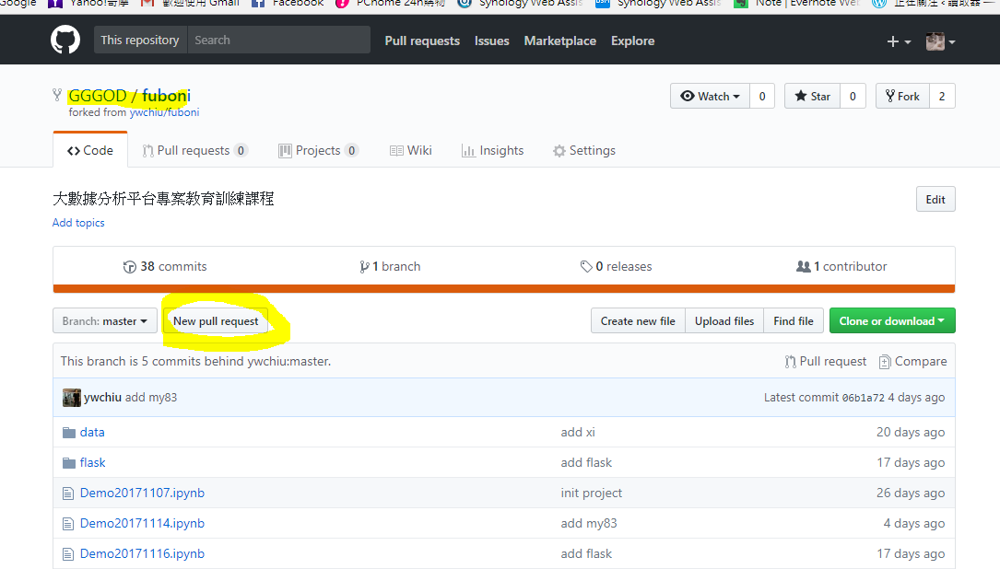

# GitHub
## GitHub 上 Fork、Watch、Star 是什麼意思？ /n
### Watch : 關注，關注後，代碼庫中有新的commit你都會收到通知；
### Star : 收藏，可以方便地找到你star過的庫，但是不會收到關於那個庫的任何通知。  
### Fork : 從別人的代碼庫中複製一份到你自己的代碼庫，與普通的複製不同，fork包含了原有庫中的所有提交記錄fork後這個代碼庫是完全獨立的，屬於你自己，你               可以在自己的庫中做任何修改

## 與別人代碼庫同步
### step1

### step2

### step3

### step4

### step5

### step6

